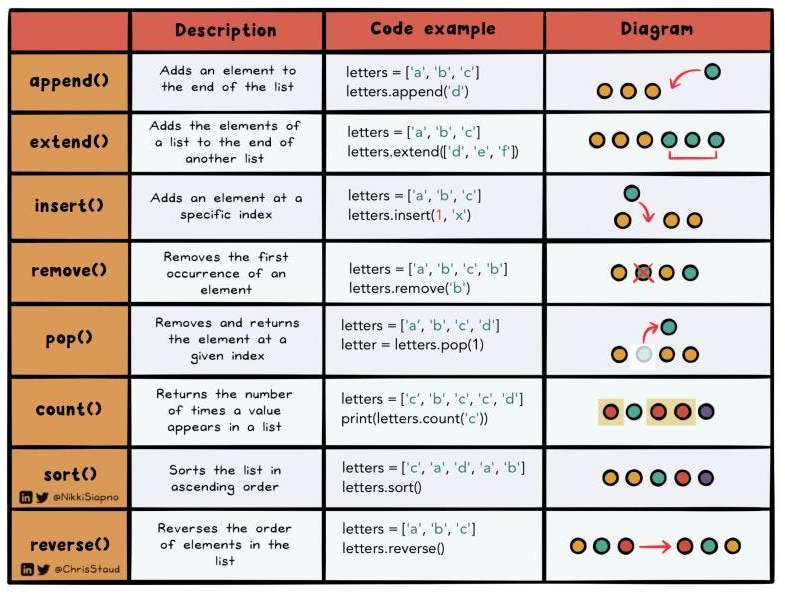
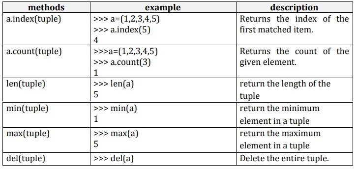
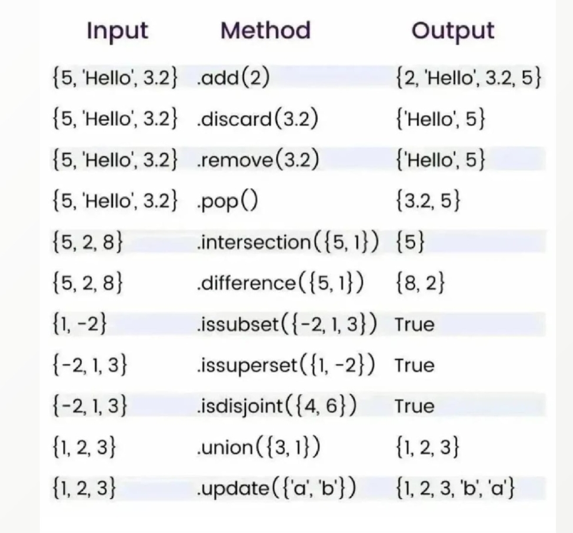
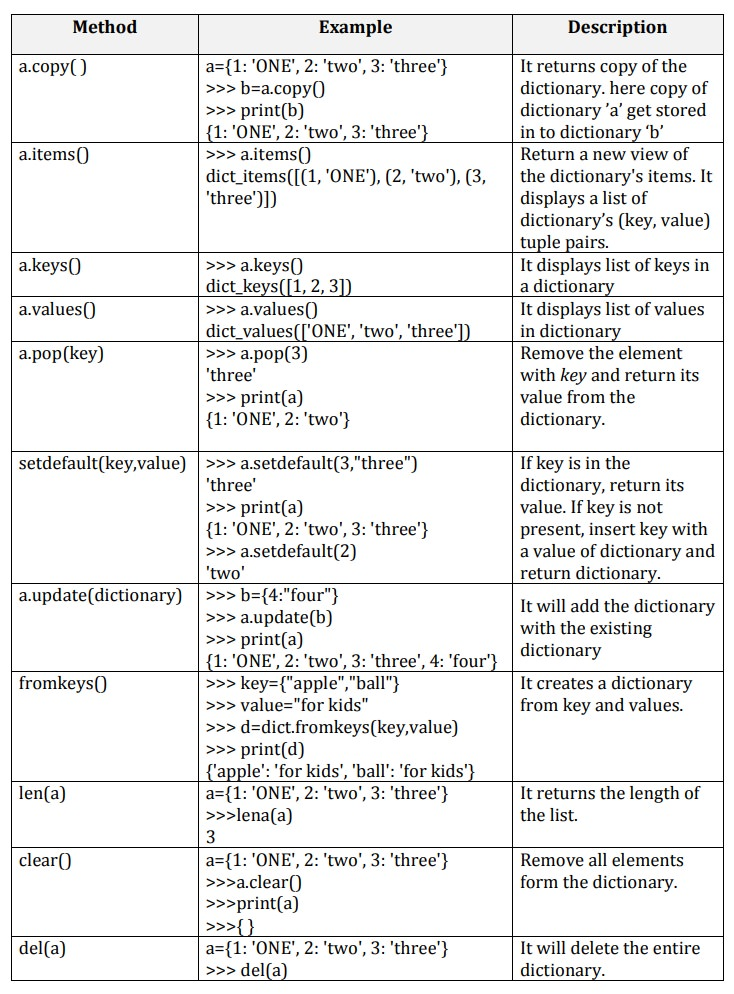

# Fundamentals of Python

# Table of Content
- [1. Chương trình đầu tiên](#1-chương-trình-đầu-tiên)
- [2. Cú pháp của Python](#2-cú-pháp-của-python)
    - [2.1. Từ khoá (keyword)](#21-từ-khoá-keyword)
    - [2.2. Chú thích (comment)](#22-chú-thích-comment)
    - [2.3. Dấu ' và "](#23-dấu--và-)
    - [2.4. Căn lề](#24-căn-lề)
    - [2.5. Viết câu lệnh](#25-viết-câu-lệnh)
- [3. Biến (Variable)](#3-biến-variable)
    - [3.1. Một số biến cơ bản.](#31-một-số-biến-cơ-bản)
    - [3.2. Ép kiểu (Type casting)](#32-ép-kiểu-type-casting)
    - [3.3. User input](#33-user-input)
- [4. Toán tử (arithmetic operator)](#4-toán-tử-arithmetic-operator)
    - [4.1. Phép toán số học](#41-phép-toán-số-học)
    - [4.2. Toán tử so sánh](#42-toán-tử-so-sánh)
    - [4.3. Phép gán](#43-phép-gán)
    - [4.4. Toán tử logic](#44-toán-tử-logic)
- [5. Cấu trúc điều khiển (Flow control)](#5-cấu-trúc-điều-khiển-flow-control)
    - [5.1. if..else stament](#51-ifelse-stament)
    - [5.2. match-case (python 3.10+)](#52-match-case-python-310)
- [6. Cấu trúc lặp](#6-cấu-trúc-lặp)
    - [6.1. Vòng lặp while](#61-vòng-lặp-while)
    - [6.2. Lệnh điều khiển vòng lặp.](#62-lệnh-điều-khiển-vòng-lặp)
    - [6.3. Vòng lặp for](#63-vòng-lặp-for)
- [7. Cấu trúc dữ liệu](#7-cấu-trúc-dữ-liệu)
    - [7.1. List \[\]](#71-list-)
    - [7.2. Tuple ()](#72-tuple-)
    - [7.3. Set {}](#73-set-)
        - [7.3.1. set](#731-set)
        - [7.3.2. frozenset](#732-frozenset)
    - [7.4. Dict {}](#74-dict-)
- [8. Hàm (Function)](#8-hàm-function)
    - [8.1. Phạm vi biến](#81-phạm-vi-biến)
    - [8.2. Hàm với tham số.](#82-hàm-với-tham-số)
    - [8.3. Hàm với giá trị trả về.](#83-hàm-với-giá-trị-trả-về)
    - [8.4. Hàm với tham số mặc định.](#84-hàm-với-tham-số-mặc-định)
    - [8.5. Hàm với tham số không cố định.](#85-hàm-với-tham-số-không-cố-định)
    - [8.6. Hàm đệ quy (Recursive Function).](#86-hàm-đệ-quy-recursive-function)
    - [8.7. Hàm Lambda](#87-hàm-lambda)
- [9. File](#9-file)
    - [9.1. Mở file:](#91-mở-file)
    - [9.2. Thao tác với file:](#92-thao-tác-với-file)
    - [9.3. Đóng file](#93-đóng-file)
- [10. Module](#10-module)
    - [10.1 Module](#101-module)
    - [10.2. `if __name__ = '__main__'`](#102-if-__name__--__main__)
- [11. Lập trình hướng đối tượng (Object Oriented Programming - OOP).](#11-lập-trình-hướng-đối-tượng-object-oriented-programming---oop)
    - [11.1. Lớp (class).](#111-lớp-class)
    - [11.2. Constructor.](#112-constructor)
    - [11.3. Phương thức (method).](#113-phương-thức-method)
        - [11.3.1. Instance method.](#1131-instance-method)
        - [11.3.2. Static method:](#1132-static-method)
        - [11.3.3. Class method:](#1133-class-method)
        - [11.3.4. Magic methods (Dunder method).](#1134-magic-methods-dunder-method)
    - [11.4. Tính đóng gói (Encapsulation).](#114-tính-đóng-gói-encapsulation)
        - [11.4.1. Ba mức truy cập của thuộc tính.](#1141-ba-mức-truy-cập-của-thuộc-tính)
        - [11.4.2. Getter, Setter, Deleter.](#1142-getter-setter-deleter)
    - [11.5. Tính kế thừa (Inheritance).](#115-tính-kế-thừa-inheritance)
    - [11.6. Tính đa hình (Polymorphism).](#116-tính-đa-hình-polymorphism)
        - [11.6.1. Đa hình qua kế thừa](#1161-đa-hình-qua-kế-thừa)
        - [11.6.2. Đa hình không kế thừa (Duck Typing) 🦆](#1162-đa-hình-không-kế-thừa-duck-typing-)
    - [11.7. Tình trừu tượng (Abstraction).](#117-tình-trừu-tượng-abstraction)


## 1. Chương trình đầu tiên
```python
print("Hello World")
```

```
Hello World
```

## 2. Cú pháp của Python
Các cú pháp của python sẽ phân biệt các ký tự thường và hoa.

### 2.1. Từ khoá (keyword)

Các từ khóa là từ được định nghĩa sẵn và không thể sử dụng làm tên biến, hàm hoặc bất kỳ định danh nào khác.

Sau đây là các từ khoá của Python (phiên bản 3.10 trở lên):

````python
False      await      else       import     pass
None       break      except     in         raise
True       class      finally    is         return
and        continue   for        lambda     try
as         def        from       nonlocal   while
assert     del        global     not        with
async      elif       if         or         yield
````

Ta có thể sử dụng module `keyword` để kiểm tra danh sách từ khoá hiện tại trong Python:

```python
import keyword
print(keyword.kwlist)
```

### 2.2. Chú thích (comment)

Để chú thích 1 dòng trong python ta sử dụng ký tự `#`:

```python
# print("Hello World")
```

Sử dụng `'''` để chú thích 1 đoạn (nhiều dòng):

```python
'''
print("We are in a comment")
print ("We are still in a comment")
'''
```

### 2.3. Dấu ' và "

Python sẽ không phân biệt dấu ```'``` và ```"```.

Thông thường đối với biến chỉ có 1 từ thì ta để dấu `'`. Còn đối với 1 câu hay đoạn thì ta để dấu `"` hoặc `"""`.

```python
word = 'word'
sentence = "This is a sentence."
message = """This's message will ... span several lines."""
```

### 2.4. Căn lề

Trong Python, ta bắt buộc phải căn lề để bao các khối lệnh của hàm, lớp hoặc luồng điều khiển,...

 Số khoảng trắng dùng để căn lề có thể tuỳ ý nhưng tất cả lệnh ttrong một khối phải được canh lề như nhau.

 ```python
 if True:
    print "Answer"
    print "True"
 else:
    print "False"
 ```

 ### 2.5. Viết câu lệnh

 Sử dụng ký tự `\` để có thể viết được trên nhiều dòng:

 ```python
 print("This message has writen \
in two lines")
 ```

 ```
 This message has writen in two lines
 ```

Sử dụng dấu `;` để viết nhiều lệnh trên dòng

```python
import sys; x = 'foo'; sys.stdout.write(x + '\n')
```

## 3. Biến (Variable)

Biến là một container dùng để lưu trữ một giá trị nhất định như integer, float, string, boolean,...

### 3.1. Một số biến cơ bản.

1. Số nguyên (integer)

```python 
age = 10
age: int = 10
```

2. Số thực (float)

```python 
height = 1.65
height: float = 1.65
```

3. Biến chuỗi (String)

```python
name = 'Python'
name: str = 'Python'
```

Chuỗi có nhiều kiểu định dạng khác nhau.

```python
message1 = "Name: %s, Age: %d, Height: %.2f" % (name, age, height)
message2 = "Name: {}, Age: {}, Height: {:.2f}".format(name, age, height)
message3 = f"Name: {name}, Age: {age}, Height: {height:.2f}"
```

```
Name = Python, Age: 10, Height: 1.65
```

Ngoài ra còn có một số ký tự đặc biệt trong chuỗi:

```markdown
\n: Di chuyển đến dòng tiếp theo
\t: Di chuyển đến khoảng cách tiếp theo nếu nhấn phím “Tab”
\\: Thêm 1 ký tự \
\": Thêm 1 ký tự "
\': Thêm 1 ký tự '
```

4. Biến Boolean lưu giá trị `True` hoặc `False`

```python
is_student = True
is_student: bool = True
```

### 3.2. Ép kiểu (Type casting)

Ép kiểu biến từ kiểu dữ liệu này sang kiểu dữ liệu khác.

```python
age: int = 25

print(type(age))

age = float(age)

print(type(age))
print(age)
```

```
<class 'int'>
<class 'float'>
25.0
```

### 3.3. User input

Sử dụng để nhập dữ liệu từ bàn phím người dùng. Dữ liệu mặc định sẽ là kiểu string, để đổi sang kiểu khác ta sẽ thực hiện ép kiểu.

```python
name = input("Your name:")
age = int(input("Your age:"))

print(f"Name: {name}, Age: {age}")
```

## 4. Toán tử (arithmetic operator)

### 4.1. Phép toán số học


### 4.2. Toán tử so sánh

Giá trị trả về là kiểu `bool`


### 4.3. Phép gán


### 4.4. Toán tử logic


## 5. Cấu trúc điều khiển (Flow control)

### 5.1. if..else stament

```python
age: int = 20

if age >= 18:
    print('adult')
else:
    print('child')
```

```
adult
```

Sử dụng nhiều if else hơn:

```python
if age >= 60:
    print('old')
elif age >= 18:
    print('adult')
else:
    print('child')
```

Viết trên 1 dòng lệnh (ngắn gọn):

```python
print('adult' if age >= 18 else 'child')
```

### 5.2. match-case (python 3.10+)

```python
match value:
    case 'a':
        return "Option A"
    case 'b':
        return "Option B"
    case 'c':
        return "Option C"
    case _: # default
        return "Unknown option"
```

## 6. Cấu trúc lặp

### 6.1. Vòng lặp while

```python
number: int = 6

while number >= 1:
    number -= 1
    print(number)
```

```
5
4
3
2
1
0
```

### 6.2. Lệnh điều khiển vòng lặp.

Lệnh `continue`: bỏ qua các câu lệnh còn lại trong vòng lặp và tiếp tục vòng lặp tiếp theo.

```python
number: int = 6

while number >= 1:
    number -= 1
    if number == 3:
        continue
    print(number)
```
```
5
4
2
1
0
```

Lệnh `break`: bỏ qua các câu lệnh còn lại trong vòng lặp và kết thúc vòng lặp.

```python
number: int = 6

while number >= 1:
    number -= 1
    if number == 3:
        continue
    print(number)
```

```
5
4
```

### 6.3. Vòng lặp for

```python
for i in range(5):
    print(i)
```

```
0
1
2
3
4
```

## 7. Cấu trúc dữ liệu

### 7.1. List []

Là một 'biến' có thể lưu trữ nhiều biến và mỗi biến có thể có nhiều kiểu dữ liệu khác nhau. 

Nó được sắp xếp và có khả năng thay đổi được, cho phép lặp dữ liệu (duplicate).

```python
list_ = ['Python', 25, 9.3, 25]

for l in list_:
    print(l)
```

```
Python
25
9.3
25
```
List comprehensive

```python
squares = [x**2 for x in range(5)]  # [0, 1, 4, 9, 16]
```

Một số phương thức (method) đối với list:



Ta có thể sử dụng hàm `dir` hoặc `help` để hiển thị được toàn bộ phương thức của nó.

```python
print(dir(list)) # Chỉ show tên phương thức
print(help(list)) # Show ra cách sử dụng phương thức chi tiết
```

### 7.2. Tuple ()

Là một 'biến' có thể lưu trữ nhiều biến và mỗi biến có thể có nhiều kiểu dữ liệu khác nhau.

Nó được sắp xếp và có tính bất biến (không thể bị thay đổi và sửa đổi). Cho phép lặp dữ liệu. Khả năng truy cập nhanh.

```python
tuple_ = ('Python', 25, 9.3, 25)

for t in tuple_:
    print(t)
```

```
Python
25
9.3
25
```

Một số phương thức đối với tuple:



### 7.3. Set {}

#### 7.3.1. set

Là một 'biến' có thể lưu trữ nhiều biến và mỗi biến có thể có nhiều kiểu dữ liệu khác nhau. Là một kiểu tập hợp.

Nó không được sắp xếp và có tính bất biến nhưng có thể thêm hoặc xoá (Add/Remove), không cho phép lặp dữ liệu (no duplicate). 

```python
set = {'Python', 25, 9.3, 25}

for s in set_:
    print(s)
```

```
25
Python
9.3
```

Một số phương thức đối với set:



#### 7.3.2. frozenset

Tương tự như set nhưng một khi đã tạo ra thì không thể thay đổi nội dung (thêm/xoá phần tử).

Do tính bất biến nên thường dùng làm key của một dictionary.

```python
fs = frozenset([1, 2, 3])
```

### 7.4. Dict {}

Là một 'biến' ánh xạ lưu trữ dữ liệu dưới dạng cặp key:value.

Nó có thể sắp xếp được và thay đổi được. Không cho phép duplicate.

```python
student = {
    "name": "Alice",
    "age": 20,
    "grades": [90, 85, 88]
}
# Hoặc sử dụng
person = dict(name="Bob", age=25)

for key, value in student.items():
    print(f"{key}: {value}")
```

```
name: Alice
age: 20
grades: [90, 85, 88]
```

Một số phương thức đối với dict:



## 8. Hàm (Function)

Hàm là một khối mã được tổ chức để thực hiện một nhiệm vụ cụ thể nhằm để tái sử dụng mã, giảm lặp lại và tăng tính tổ chức.

Hàm có thể nhận đầu vào (tham số) và trả về kết quả.

```python 
def say_hello():
    print("Hello World")

say_hello() # Gọi hàm
```

```
Hello World
```

### 8.1. Phạm vi biến

Biến cục bộ (Local variable): Chỉ tồn tại trong hàm.

Biến toàn cục (Global variable): Có thể truy cập từ mọi nơi trong chương trình.

```python
x = 10  # Biến toàn cục

def my_function():
    x = 5  # Biến cục bộ
    print(x) # 5

my_function()
print(x) # 10
```

```
5
10
```

### 8.2. Hàm với tham số.

```python
def greet(name):
    print(f"Hello, {name}!")

greet("Turing")
```

```
Hello Turing
```

### 8.3. Hàm với giá trị trả về.

```python
def add(a, b):
    return a + b

result = add(3, 5)
print(result)
```

```
8
```

### 8.4. Hàm với tham số mặc định.

```python
def greet(name="Python"):
    print(f"Hello, {name}!")

greet()  # Sử dụng giá trị mặc định
greet("Alice")  # Ghi đè giá trị mặc định
```

```
Hello Python
Hello Alice
```

### 8.5. Hàm với tham số không cố định.

`*args`: Truyền một danh sách tham số không cố định (kiểu tuple). (viết tắt của arguments)

```python
def sum_all(*args):
    return sum(args)

print(sum_all(1, 2, 3))
```

```
6
```

`**kwargs`: Truyền từ điển (dictionary) tham số không cố định. (viết tắt của keyword arguments)

```python
def print_info(**kwargs):
    for key, value in kwargs.items():
        print(f"{key}: {value}")

print_info(name="Alice", age=30)
```

```
name: Alice
age: 30
```

### 8.6. Hàm đệ quy (Recursive Function).

Gọi lại chính nó để giải quyết các bài toán chia nhỏ.

```python
def factorial(n):
    if n == 1:
        return 1
    else:
        return n * factorial(n - 1)

print(factorial(5)) # 5*4*3*2*1 = 120  
```

### 8.7. Hàm Lambda

Là một cách viết **hàm ẩn danh** (anonymous function) — tức là hàm không tên, gọn nhẹ và thường dùng cho các tình huống đơn giản, nhất là trong các biểu thức hàm bậc cao như map(), filter(), sorted(), v.v.

Cú pháp

```python
lambda arguments: expression
```

Ví dụ:

```python
f = lambda x: x**2

print(f(5))  # 25

# Tương đương với

def f(x):
    return x**2

print(f(5)) # 25
```

Lambda với nhiều tham số:

```python
add = lambda x, y: x + y
print(add(3, 4))  # 7
```

## 9. File

Trong Python, thao tác với file rất phổ biến và được thực hiện thông qua các hàm tích hợp như open(), read(), write(), close(), v.v.

✅ Các bước cơ bản khi thao tác với file:

1. Mở file bằng open()

2. Đọc / ghi / xử lý

3. Đóng file bằng close() (hoặc dùng with để tự động đóng)

### 9.1. Mở file:

```python
f = open("data.txt", "r")  # "r" là chế độ đọc (read)

# Nếu dùng with .. as thì không cần đóng file (close())
with open("data.txt", "r") as f:
    # thao tác với file
```

| Chế độ | Ý nghĩa                                   |
|--------|-------------------------------------------|
| `'r'`  | Đọc (mặc định)                            |
| `'w'`  | Ghi (xóa file cũ nếu có)                  |
| `'a'`  | Ghi thêm (append)                         |
| `'x'`  | Tạo file mới, lỗi nếu file đã tồn tại     |
| `'b'`  | Nhị phân (binary)                         |
| `'t'`  | Văn bản (text, mặc định)                  |


### 9.2. Thao tác với file:

1. Đọc file.

```python
with open("data.txt", "r") as f:
    content = f.read()
```

2. Ghi file.

```python
with open("output.txt", "w") as f:
    f.write("Hello, world!\n")
    f.write("This is a file.\n")
```

3. Xử lý file.

Thực hiện thêm xoá,...

### 9.3. Đóng file

Nếu không dùng `with..as` thì ta cần sử dụng `close()` để đóng file.

## 10. Module

### 10.1 Module

Module là một tệp chứa mã Python (thường là .py) với các hàm, lớp, biến, hoặc đoạn mã có thể được tái sử dụng trong chương trình khác. 

Nói cách khác, module giúp tổ chức mã theo từng phần rõ ràng, dễ quản lý và tái sử dụng.

✅ Có 3 loại module chính:

| Loại module                    | Ví dụ                             |
|--------------------------------|-----------------------------------|
| Module chuẩn (standard)        | `math`, `os`, `sys`, `datetime`,... |
| Module bên ngoài (third-party) | `numpy`, `pandas`, `requests`,... (cài bằng `pip`) |
| Module tự tạo (custom)         | File `.py` bạn viết như `my_utils.py` |

```python
from math import pi

print(pi) # 3.141592653589793
```

Ví dụ về custom module.

```cmd
module
├───main.py
└───my_utils.py
```

Trong `my_utils.py`:

```python
def say_hello():
    print("Hello from my_utils!")
```

Trong `main.py`:

```python
import my_utils

my_utils.say_hello() # Hello from my_utils!
```

### 10.2. `if __name__ = '__main__'`

Là cú pháp đặc biệt trong Python, dùng để xác định một file đang được chạy trực tiếp hay bị import từ file khác.

```python
if __name__ == '__main__':
    # đoạn code này chỉ chạy khi file được chạy trực tiếp
```

Khi chạy file trực tiếp bằng

```bash
python my_file.py
```

thì biến đặc biệt `__name__` sẽ có giá trị là `'__main__'`.

Nhưng nếu file đó được import vào file khác, thì `__name__` sẽ là tên module (tức là tên file không có đuôi .py).

Ví dụ:

Trong `my_utils.py`:
```python
def say_hello():
    print("Hello from my_utils!")

print("This is my_utils.py")

if __name__ == "__main__":
    print("Run my_utils.py directly")
```

Trong `main.py`:
```python
import my_utils

my_utils.say_hello()

print("Run main.py directly")
```

Khi chạy `my_utils.py`:

```bash
python my_utils.py
```

Kết quả:

```
This is my_utils.py
Run my_utils.py directly
```

Khi chạy `main.py`:

```bash
python main.py
```

```
This is my_utils.py
Hello from my_utils!
Run main.py directly
```

## 11. Lập trình hướng đối tượng (Object Oriented Programming - OOP).

OOP là một phương pháp lập trình mà trong đó các đối tượng thực tế được mô phỏng thành các đối tượng trong code.

Các đối tượng có **thuộc tính (attributes)** và **hành vi (methods)**, và chúng tương tác với nhau để thực hiện các chức năng trong chương trình.

### 11.1. Lớp (class).

Lớp là một bản thiết kế (blueprint) cho việc tạo ra các đối tượng. 

Mỗi lớp có thể chứa các thuộc tính (tương ứng với biến) và phương thức (tương ứng với hàm).

```python
class Car:
    pass

car = Car()

car1.brand = "Toyota"
car1.model = "Camry"
car1.year = 2022

print(f"{car.brand} {car.model} {car.year}")
# 'Toyota Camry 2022'
```

### 11.2. Constructor.

Là phương thức thường dùng để **khởi tạo** các thuộc tính có trong class.

```python
class Car:
    def __init__(self, brand, model, year):
        self.brand = brand
        self.model = model
        self.year = year

car1 = Car("Toyota", "Camry", 2022)
car2 = Car("Honda", "Accord", 2021)

print(f"{car1.brand} {car1.model} {car1.year}")
print(f"{car2.brand} {car2.model} {car2.year}")
```

```
Toyota Camry 2022
Honda Accord 2021
```

Thuộc tính toàn cục (global attribute).

```python
class Car:
    price = "Unknown"
    car_index = 1
    def __init__(self, brand, model, year):
        self.brand = brand
        self.model = model
        self.year = year

        self.car_index = Car.car_index
        Car.car_index +=1

car1 = Car("Toyota", "Camry", 2022)
car2 = Car("Honda", "Accord", 2021)
car3 = Car("Ford", "Mustang", 2023)
car4 = Car("Chevrolet", "Malibu", 2020)
car5 = Car("Nissan", "Altima", 2019)

print(car1.price) # Unknown

for car in [car1, car2, car3, car4, car5]:
    print(car.car_index)
# 1 2 3 4 5
```

### 11.3. Phương thức (method).

#### 11.3.1. Instance method.
```python
class Car:
    def __init__(self, brand, model, year):
        self.brand = brand
        self.model = model
        self.year = year

    def describe(self):
        return f"{self.year} {self.brand} {self.model}"

car1 = Car("Toyota", "Camry", 2022)
car2 = Car("Honda", "Accord", 2021)

print(car2.describe()) # 2021 Honda Accord
```

#### 11.3.2. Static method: 

Là các method không dùng đến attribute của class. Dùng `@staticmethod` để thực hiện.

```python
class Car:
    def __init__(self, brand, model, year):
        self.brand = brand
        self.model = model
        self.year = year

    def describe(self):
        return f"{self.year} {self.brand} {self.model}"
    
    # static method
    @staticmethod
    def plus(a, b):
        return a + b

car2 = Car("Honda", "Accord", 2021)
car2.plus(3.7, 4.5) # 8.2
```

#### 11.3.3. Class method:

Là một loại phương thức có thể gọi trên class mà không cần tạo ra một đối tượng (instance) của class đó.

Phương thức này nhận một tham số đầu tiên là cls, đại diện cho lớp hiện tại, cho phép bạn truy cập các thuộc tính và phương thức của lớp mà không cần một đối tượng cụ thể.

```python
class Car:
    def __init__(self, brand, model, year):
        self.brand = brand
        self.model = model
        self.year = year

    def describe(self):
        return f"{self.year} {self.brand} {self.model}"

    @classmethod
    def from_string(cls, car_string):
        brand, model, year = car_string.split(", ") # tách chuỗi
        return cls(brand, model, int(year)).describe()

car = Car.from_string("Honda, Accord, 2021")
print(car) # 2021 Honda Accord
```

#### 11.3.4. Magic methods (Dunder method).

Là những phương thức đặc biệt được định nghĩa trong các lớp để cung cấp các hành vi mặc định cho các phép toán hoặc hoạt động đặc biệt. 

Chúng thường được nhận dạng bằng việc có hai dấu gạch dưới ở cả trước và sau tên phương thức, ví dụ như `__init__`, `__str__`, `__add__`, v.v.

Một số magic methods phổ biến:

1. `__init__`: constructor.

```python
class Car:
    def __init__(self, brand, model, year, price):
        self.brand = brand
        self.model = model
        self.year = year
        self.price = price
```

2. `__str__`: Được gọi khi bạn in đối tượng.

```python
class Car:
    def __init__(self, brand, model, year, price):
        self.brand = brand
        self.model = model
        self.year = year
        self.price = price

    def __str__(self):
        return f"{self.year} {self.brand} {self.model} {self.price}"

car1 = Car("Toyota", "Camry", 2022, 50000)
print(car1)
# <__main__.Car object at 0x0000023D4F78D330> nếu không có __str__
# 2022 Toyota Camry 50000 nếu có __str__
```

3. `__eq__`: Được gọi khi bạn dùng toán tử so sánh `==` với đối tượng của lớp.

```python
class Car:
    def __init__(self, brand, model, year, price):
        self.brand = brand
        self.model = model
        self.year = year
        self.price = price

    def __eq__(self, other):
        return self.year == other.year

car1 = Car("Toyota", "Camry", 2022, 50000)
car2 = Car("Honda", "Accord", 2021, 80000)

print(car1 == car2) # False
```

4. `__add__`: Được gọi khi bạn dùng toán tử + với đối tượng của lớp.

```python
class Car:
    def __init__(self, brand, model, year, price):
        self.brand = brand
        self.model = model
        self.year = year
        self.price = price

    def __add__(self, other):
        return self.price + other.price

car1 = Car("Toyota", "Camry", 2022, 50000)
car2 = Car("Honda", "Accord", 2021, 80000)

print(car1 + car2) # 130000
```

5. `__lt__`: Được gọi khi bạn dùng toán tử so sánh `<` với đối tượng của lớp.

6. `__gt__`: Được gọi khi bạn dùng toán tử so sánh `>` với đối tượng của lớp.

### 11.4. Tính đóng gói (Encapsulation).

Đóng gói là việc giấu thông tin chi tiết của đối tượng và chỉ cho phép tương tác với đối tượng thông qua các phương thức công khai (public methods).

#### 11.4.1. Ba mức truy cập của thuộc tính.

Public, Protected, Private

| Cách viết        | Ý nghĩa                                      | Truy cập từ bên ngoài              |
|------------------|----------------------------------------------|------------------------------------|
| `self.name`      | Public – ai cũng dùng được                    | ✅ Có thể                           |
| `self._name`     | Protected – ngầm bảo vệ (khuyên dùng nội bộ) | ⚠️ Có thể, nhưng hạn chế           |
| `self.__name`    | Private – ẩn hoàn toàn khỏi bên ngoài        | ❌ Không thể (trừ khi "hack")      |

```python
class Car:
    def __init__(self, brand, model, year):
        self._brand = brand     # protected
        self.__model = model    # private
        self.year = year        # public

    def describe(self):
        return f"{self.year} {self._brand} {self.__model}"

    def start(self):
        print(f"{self.describe()} is starting.")

car1 = Car("Toyota", "Camry", 2022)
print(car1.describe()) # 2022 Toyota Camry

print(car1.year)       # 2022
print(car1._brand)     # Toyota
print(car1.__model)    # AttributeError: 'Car' object has no attribute '__model'
```

Tuy nhiên Python không có 'Private' thực sự. Ta vẫn truy cập được bằng

```python
car1._Car__model # Camry
```

Điều này không được khuyến khích.

#### 11.4.2. Getter, Setter, Deleter.

Thường là phương thức được dùng để có thể gán (set), lấy (get), xoá (delete) thuộc tính trong class. Ta sử dụng `@property` để thực hiện.

`@property` là một `decorator` cho phép bạn đọc/ghi một cách tự nhiên như biến, nhưng thực tế đang gọi method ẩn bên trong.

```python
class Car:
    def __init__(self, brand, model, year):
        self.__brand = brand
        self.model = model
        self.year = year

    def describe(self):
        return f"{self.year} {self.__brand} {self.model}"

    @property
    # getter
    def brand(self):
        return self.__brand

    @brand.setter
    # setter
    def brand(self, new_brand):
        self.__brand = new_brand

    @brand.deleter
    # deleter
    def brand(self):
        self.__brand = None

car1 = Car("Toyota", "Camry", 2022)
print(car1.describe()) # 2022 Toyota Camry

car1.brand = "Honda"    # Gọi setter
print(car1.brand)       # Gọi getter
del car1.brand          # Gọi deleter
```

### 11.5. Tính kế thừa (Inheritance).

Kế thừa (Inheritance) cho phép bạn tạo một class con (subclass) kế thừa thuộc tính và phương thức từ một class cha (superclass).

Đây là cách để tái sử dụng code, mở rộng chức năng.

```python
class Car:
    def __init__(self, brand, model, year):
        self.brand = brand
        self.model = model
        self.year = year

    def describe(self):
        return f"{self.year} {self.brand} {self.model}"

class ElectricCar(Car): # Kế thừa từ lớp Car
    def __init__(self, brand, model, year, battery_size):
        super().__init__(brand, model, year) # Dùng super() để kế thừa attri từ lớp cha
        self.battery_size = battery_size

    def describe_battery(self):
        print(f"This car has a {self.battery_size}-kWh battery.")

electric_car = ElectricCar("Tesla", "Model 3", 2023, 75)
print(electric_car.describe()) # 2023 Tesla Model 3
electric_car.describe_battery() # This car has a 75-kWh battery.
```

### 11.6. Tính đa hình (Polymorphism).

Cùng một phương thức, nhưng các đối tượng khác nhau có thể hành vi khác nhau.

#### 11.6.1. Đa hình qua kế thừa

Class con ghi đè method lên class cha để thay đổi hành vi.

```python
class Car():
    def start_engine(self):
        return "The car has started."

class ElectricCar(Car):
     def start_engine(self):
        return "The electric car has started without the sound of the engine."

class GasolineCar(Car):
    def start_engine(self):
        return "The gasoline car has started with the sound of the engine."

cars = [
    Car()
    ElectricCar(),
    GasolineCar()
]

for car in cars:
    print(car.start_engine())
```

```
The car has started.
The electric car has started without the sound of the engine.
The gasoline car has started with the sound of the engine.
```

#### 11.6.2. Đa hình không kế thừa (Duck Typing) 🦆

Python không cần class kế thừa, chỉ cần object có method đúng tên là dùng được → gọi là “duck typing”

```python
class ElectricCar():
     def start_engine(self):
        return "The electric car has started without the sound of the engine."

class GasolineCar():
    def start_engine(self):
        return "The gasoline car has started with the sound of the engine."

def start(object):
    print(object.start_engine())

cars = [
    ElectricCar(),
    GasolineCar()
]

for car in cars:
    start(car)
```

```
The electric car has started without the sound of the engine.
The gasoline car has started with the sound of the engine.
```

### 11.7. Tình trừu tượng (Abstraction).

Tính trừu tượng là khả năng ẩn đi chi tiết phức tạp, chỉ cho thấy những gì quan trọng nhất.

“Chỉ cần biết *làm được gì*, không cần biết *làm như thế nào*.”

Python hỗ trợ trừu tượng thông qua:

1. Lớp trừu tượng (abstract class)

2. Phương thức trừu tượng (abstract method)

Thông qua module abc (Abstract Base Class)

```python
from abc import ABC, abstractmethod

class Car(ABC): # Lớp trừu tượng → không thể tạo đối tượng trực tiếp
    @abstractmethod
    # phương thức trừu tượng → class con phải ghi đè (overdrive)
    def start_engine(self):
        pass

class ElectricCar(Car):
     def start_engine(self):
        return "The electric car has started without the sound of the engine."

car = ElectricCar()
print(car.start_engine())
# The electric car has started without the sound of the engine.

car = Car()
# TypeError: Can't instantiate abstract class Car with abstract method start_engine
```